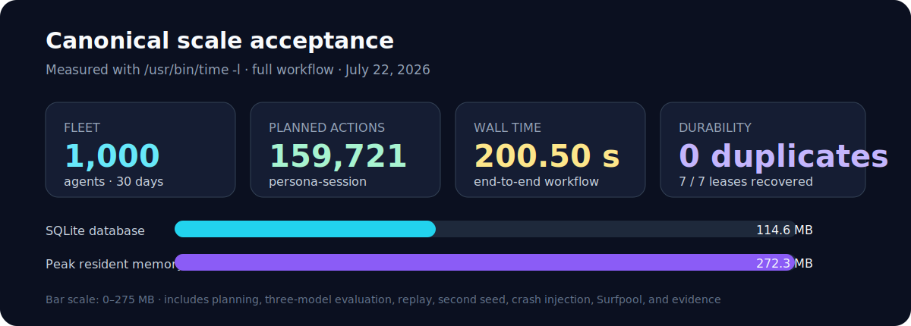
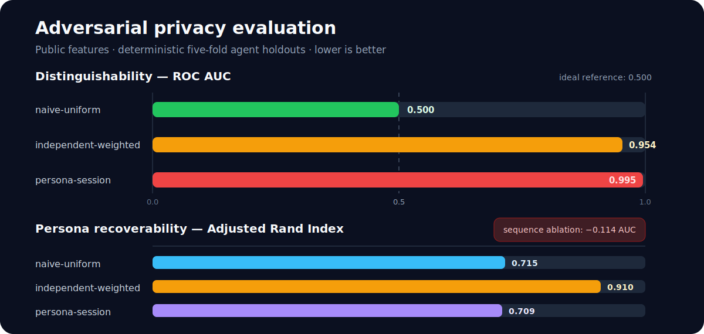
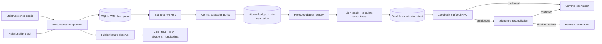

<div align="center">

# account-cooker

### Policy-caged, adversary-aware Solana activity fleets in Rust

[](https://github.com/lucascpas23/account-cooker/actions/workflows/ci.yml)
[](rust-toolchain.toml)
[](LICENSE)
[](crates)

**1,000 agents · 30 virtual days · 159,721 planned actions · exact Surfpool transaction acceptance · zero blind retries**

[Quick start](#quick-start) · [Measured results](#measured-results) · [Architecture](#architecture) · [Safety](#safety-invariants) · [Submission guide](SUBMISSION.md) · [Engineering audit](AUDIT.md)

</div>

`account-cooker` is a production-oriented fleet manager for long-lived Solana activity agents (“clankers”). It combines hierarchical behavioral modeling, durable scheduling, protocol adapters, strict transaction policy, embedded local execution, and a public-feature adversarial evaluator.

It was built for Superteam Brasil’s **Privacy-Through-Noise** mission. It is privacy research software—not a claim of anonymity. Funding paths, fee payers, timing, amounts, programs, ownership, and long-term graph structure remain visible on-chain.

## Why this implementation is different

| Problem | Engineering answer |
|---|---|
| Thousands of agents cannot each own a sleeping task | Indexed SQLite due queue, batch leases, per-agent serialization, and bounded Tokio workers |
| In-memory budgets fail under concurrency or restart | Atomic SQLite reservations for agent/fleet spend and agent/fleet/protocol rates |
| RPC response loss can duplicate transactions | Local signature before RPC, durable submission intent, signature-only reconciliation, and no blind retry |
| “Simulated” can differ from “submitted” | Submission is allowed only for the exact serialized signed bytes cached by successful simulation |
| Behavioral claims are easy to overstate | Three baselines, five-fold agent holdouts, clustering/classification, ablations, longitudinal analysis, and unfavorable results retained |
| Local acceptance is often environment-dependent | Pinned Surfpool SDK 1.5.0 is embedded, offline, loopback-only, and started by Rust `xtask` |
| New protocol support tends to leak into the scheduler | The scheduler depends on `ProtocolAdapter`; protocol-specific construction remains in adapter crates |

## Measured results

The canonical acceptance run was executed on July 22, 2026 with seed `181141552`. Results below come from `/usr/bin/time -l cargo xtask full-demo`; generated JSON, CSV, Markdown, and run metadata passed SHA-256 verification.



| Acceptance signal | Observed result |
|---|---:|
| Same-seed deterministic replay | identical count and trace |
| Second seed | 158,469 actions, different trace |
| Expired leases recovered | 7 / 7 |
| Bounded instruction simulations | 64 |
| Embedded Surfpool submit / confirm | 1 / 1 |
| Fee-payer balance change | 1,000,000,000 → 999,995,000 lamports |
| Ambiguous submit / post-restart reconciliation | 1 / 1 |
| Duplicate signatures | 0 |

Primary trace:

```text
dba0325230d56d0879144b7b621c4983417bfa172623680f656871c902e38461
```

Second-seed trace:

```text
ac6c919ec629bc910e6c24f86db496db2ac634090104a47e38210a61de7a3148
```

### Honest privacy evaluation

The bundled observer sees timestamps, amounts, protocol sequence, counterparties, sessions inferred from public time gaps, funding relationships, consolidation, and account age. It never reads planner-private session IDs. Classification is deterministic five-fold out-of-sample evaluation at the agent level.



| Planner | Actions | Active agents | ARI ↓ | NMI ↓ | ROC AUC toward 0.5 | Precision | Recall | F1 |
|---|---:|---:|---:|---:|---:|---:|---:|---:|
| naive-uniform | 59,526 | 1,000 | 0.715 | 0.800 | 0.500 | 0.500 | 1.000 | 0.667 |
| independent-weighted | 59,304 | 980 | 0.910 | 0.907 | 0.954 | 0.959 | 0.803 | 0.874 |
| persona-session | 159,721 | 989 | 0.709 | 0.829 | **0.995** | 1.000 | 0.891 | 0.942 |

The persona model is highly distinguishable from the naive baseline. Protocol sequence is its strongest measured fingerprint: removing sequence features reduces AUC by `0.114`; removing timing reduces it by `0.012`. This is a negative privacy result, not a success metric. It remains in the evidence because synthetic traffic must not be presented as anonymity.

See [privacy evaluation methodology](docs/privacy-evaluation.md) and the complete [engineering audit](AUDIT.md).

## Architecture



The scheduler never branches on protocol type. It sees declared action support, required program IDs, cost estimates, instructions, expected changes, and reconciliation behavior through the adapter contract.

### Workspace map

| Crate | Responsibility |
|---|---|
| `account-cooker-core` | Domain states, personas, planners, graph, policy, adapter contract |
| `account-cooker-config` | Strict configuration schema and fail-closed validation |
| `account-cooker-store` | WAL persistence, migrations, leases, reservations, reconciliation evidence |
| `account-cooker-protocols` | Native SOL, memo, SPL token, stake, and example adapters |
| `account-cooker-scheduler` | Bounded execution pipeline and exact-byte loopback transport |
| `account-cooker-evaluator` | Synthetic observer, clustering, classification, ablations, time windows |
| `account-cooker-keystore` | Age/scrypt encrypted storage and signer abstraction |
| `account-cooker-cli` | Fleet operations, reports, evaluation, and evidence commands |
| `xtask` | Reproducible demos and embedded Surfpool acceptance |

## Behavioral model

Five shipped personas differ in more than keypairs:

- `casual-holder`
- `active-trader`
- `staking-oriented`
- `token-explorer`
- `low-frequency-long-term`

The `persona-session` planner combines Poisson session counts, wrapped-normal activity hours, log-normal session lengths/inter-action delays/amounts, weekday/weekend variation, session protocol affinity, recurring graph peers, rare events, and consolidation. Per-session action caps plus daily and rolling-week spend caps bound heavy tails.

Three required planning baselines remain independently reproducible:

1. `naive-uniform`
2. `independent-weighted`
3. `persona-session`

Explicit seeds reproduce exact traces. If `--seed` is omitted, the CLI draws one from Rust’s operating-system-seeded CSPRNG, prints it, and records provenance for replay.

## Safety invariants

The default configuration is intentionally boring and restrictive:

- planning-only and dry-run enabled;
- transaction sending disabled;
- loopback RPC required;
- public clusters disabled;
- simulation mandatory;
- action/program allowlists;
- bounded spend, rates, compute, priority fees, concurrency, retries, and runtime;
- minimum fee reserves;
- emergency stop, agent pause, persona-group pause, fleet pause, and protocol pause;
- no arbitrary-instruction adapter;
- no automatic funding of public accounts;
- no implicit fund transfer during drain.

Unknown transaction outcomes keep their budget reservation and enter reconciliation. Anything that may have reached a validator is never returned automatically to `planned`.

## Quick start

### Requirements

- Rust 1.97.1, pinned by `rust-toolchain.toml`
- No system SQLite—the workspace uses bundled SQLite
- No external Surfpool binary—the pinned SDK is embedded by `xtask`

The first `xtask` build is large because it compiles the full Surfpool/Agave runtime.

### Safe fleet workflow

```bash
cargo build --workspace --all-features
cargo run -p account-cooker-cli -- init
cargo run -p account-cooker-cli -- doctor
cargo run -p account-cooker-cli -- fleet create --count 100 --seed 42
cargo run -p account-cooker-cli -- plan --days 7 --seed 42 --model persona-session
cargo run -p account-cooker-cli -- run --dry-run --bounded-cycles 2
cargo run -p account-cooker-cli -- report --json
```

`init` refuses to overwrite existing state. Planning performs no network calls.

### Canonical acceptance

```bash
cargo xtask full-demo
cargo xtask verify-evidence
```

This command:

1. plans 1,000 agents across 30 days;
2. proves same-seed replay and second-seed divergence;
3. evaluates all three planners;
4. injects and recovers expired leases;
5. starts embedded offline Surfpool on a dynamic loopback port;
6. simulates and submits the exact same signed memo transaction;
7. verifies signature and balance delta;
8. injects RPC response loss, restarts the scheduler, and reconciles without resubmission;
9. writes sanitized evidence and verifies its hashes.

## Test and quality gates

```bash
cargo fmt --all -- --check
cargo clippy --workspace --all-targets --all-features -- -D warnings
cargo test --workspace --all-features
cargo test --doc --workspace
cargo build --workspace --all-features --release
cargo audit
cargo deny check
cargo xtask demo
cargo xtask verify-evidence
```

Final local result: **34 tests passed**, all doctests passed, strict Clippy passed, release build passed, evidence verified, and `cargo deny check` reported `advisories ok, bans ok, licenses ok, sources ok`.

The pinned Surfpool 1.5.0 offline-only dependency graph contains six explicitly acknowledged RustSec vulnerabilities and additional maintenance warnings. They are enumerated in `.cargo/audit.toml`, `deny.toml`, and [AUDIT.md](AUDIT.md); any new advisory remains a failure.

CI separates quality, supply-chain, security, and scale jobs in [`.github/workflows/ci.yml`](.github/workflows/ci.yml).

## CLI

```text
account-cooker init
account-cooker doctor
account-cooker fleet create | inspect
account-cooker plan
account-cooker run
account-cooker pause | resume
account-cooker drain
account-cooker reconcile
account-cooker evaluate
account-cooker report
account-cooker evidence | verify-evidence
```

`pause` and `resume` target one `--agent`, one `--persona`, or the latest fleet. `drain` requires `--confirm` and changes lifecycle only. `reconcile` queries known signatures and refuses blind resubmission. Normal CLI operation has no public-cluster broadcast path.

## Adding a protocol

Implement `ProtocolAdapter`, declare supported actions and every required program ID, validate configuration, estimate cost and balance needs, build typed instructions, describe expected changes, and register it. No scheduler modification is required.

See [adding a protocol](docs/adding-a-protocol.md) and `ExampleReadOnlyAdapter` in `account-cooker-protocols`.

## Documentation

- [Submission guide](SUBMISSION.md)
- [Engineering audit](AUDIT.md)
- [Architecture](docs/architecture.md)
- [Behavioral model](docs/behavioral-model.md)
- [Scheduler and recovery](docs/scheduler-and-recovery.md)
- [Privacy evaluation](docs/privacy-evaluation.md)
- [Threat model](docs/threat-model.md)
- [Operations](docs/operations.md)
- [Dependency compatibility and accepted risks](docs/dependencies.md)
- [Responsible use](docs/responsible-use.md)
- [Contributing](CONTRIBUTING.md)
- [Security policy](SECURITY.md)

## Responsible use

Do not use this project for wash trading, fake volume, market or governance manipulation, referral/airdrop farming, NFT wash trading, bridge abuse, dust spam, attacks on third-party programs, stolen keys, or unrestricted arbitrary instructions.

Synthetic activity does not create cryptographic anonymity and does not guarantee unlinkability. Operate only accounts and funds you are authorized to control.

## License

MIT licensed. The repository’s original [LICENSE](LICENSE) is preserved.
